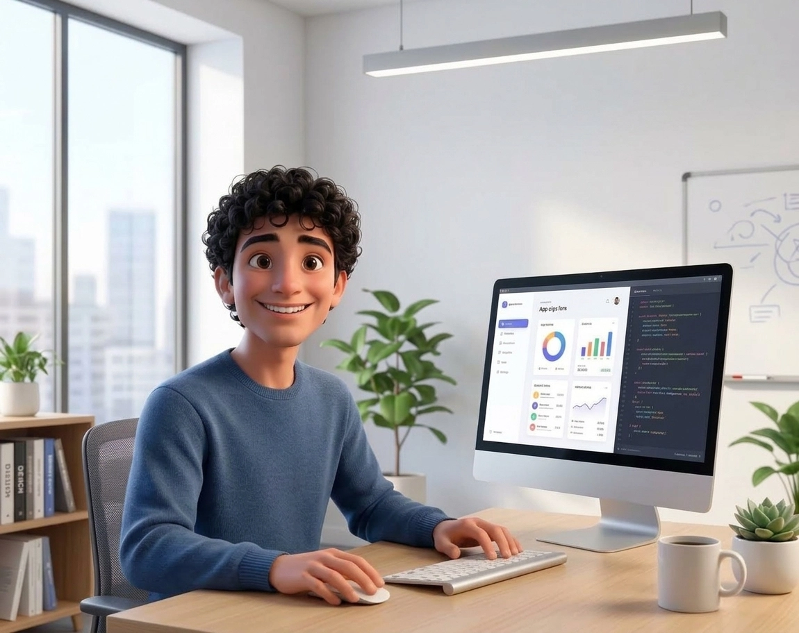

## Hello World, I'm Nicola Matera 👋

### What I Do: 

I design and develop digital solutions built around the user. 

I combine the principles of cognitive ergonomics, interaction design, and persuasion with modern, clean code, leveraging technologies like React and Tailwind to create effective and intuitive experiences.

I approach each project with a deep understanding of the problem, maintaining a rigorous focus on user experience (UX) and interface (UI). After carefully studying and designing every single interaction, I bring ideas to life by translating the design into solid, functional code using React, Tailwind, Bootstrap, and WordPress.

### Skills: 
- **Methodology:** User Research, Usability Testing, Cognitive Ergonomics, Interaction Design, Cultural Context, Typography
- **Prototyping:** Figma
- **Development:** React, Tailwind CSS, Bootstrap, HTML, CSS, JS 
